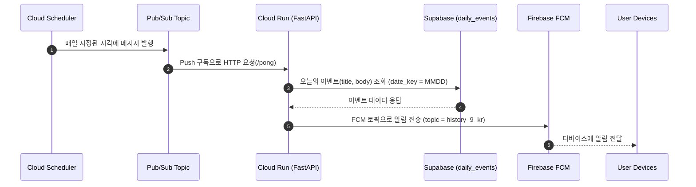

### 🍯 Honey History Cloud Run — FCM 스케줄 발송 서비스

매일 지정된 시각에 Pub/Sub를 통해 트리거되어 FCM 토픽으로 알림을 발송하는 Google Cloud Run 기반 서비스입니다. 알림 콘텐츠(`title`, `body`)는 Supabase에서 조회하여 전송합니다.

- **플랫폼**: Google Cloud Run + Cloud Scheduler + Pub/Sub + Firebase Cloud Messaging
- **데이터 소스**: Supabase `daily_events` 테이블 (`date_key` = MMDD)
- **시간대 처리**: 토픽명에서 오프셋을 파싱하여 UTC 기준 시각에 적용 (예: `history_9_kr` → UTC+9)


### 🧭 아키텍처 개요




### 🗂️ 주요 파일

- `main.py`: FastAPI 앱, `/ping`, `/`(정보), `/pong`(Pub/Sub 트리거) 엔드포인트. Supabase 조회 및 FCM 발송 로직 포함
- `Dockerfile`: Python 3.11-slim 기반 컨테이너 이미지 정의, 포트 `8080`에서 `uvicorn` 실행
- `deploy.sh`: `gcloud run deploy`를 이용한 간단 배포 스크립트 (프로젝트/리전 수정 필요)
- `requirements.txt`: FastAPI, Uvicorn, Supabase, Firebase Admin 등 런타임 의존성


### ⏰ 시간대/토픽 규칙

- 토픽명 예: `history_9_kr`
  - 가운데 숫자(정수)를 UTC 오프셋(시간)으로 파싱합니다. 예: `_9_` → `+9h`, `_-3_` → `-3h`
  - 숫자 추출 실패 시 `kr` 지역이 포함되면 기본값 `+9h`를 적용합니다
- 날짜 키 생성 로직
  - 서버는 `UTC` 기준으로 동작하며, 파싱한 오프셋을 더하여 현지 날짜 키를 만듭니다
  - 예) `UTC` + `9h` → `today_dt.strftime('%m%d')` = `MMDD` 형식으로 `date_key` 조회


### 🧾 데이터 모델 (Supabase)

- 테이블: `daily_events`
- 필드: `date_key`(문자열, `MMDD`), `title`(문자열), `body`(문자열)
- 예시 레코드

```json
{
  "date_key": "0820",
  "title": "오늘의 역사",
  "body": "오늘은 무슨 일이 있었을까요?"
}
```


### 🔌 API 엔드포인트

- `GET /ping`: 헬스체크. Supabase 연결 상태 등 간단 상태 반환
- `GET /`: 서비스 정보 및 기능 요약 반환
- `POST /pong`: Pub/Sub Push 트리거 엔드포인트
  - 요청 바디는 로깅 용도로만 사용되며, 실제 알림 콘텐츠는 Supabase 조회 결과가 우선합니다
  - 서비스 내부 기본 토픽: ``history_9_kr``


### 🔑 환경 변수

- `SUPABASE_URL`: Supabase 프로젝트 URL
- `SUPABASE_ANON_KEY`: Supabase 익명 키
- `FIREBASE_CREDENTIALS_PATH`(선택): Firebase 서비스 계정 키 JSON 경로
  - 미지정 시 Cloud Run의 기본 서비스 계정(ADC)로 초기화 시도
- `PORT`: Cloud Run이 자동 설정(기본 8080). 수동 설정 불필요


### 🧪 로컬 개발

```bash
# 1) 의존성 설치 (Python 3.11 권장)
pip install -r requirements.txt

# 2) 환경 변수 설정 (.env 사용 가능)
export SUPABASE_URL="<YOUR_SUPABASE_URL>"
export SUPABASE_ANON_KEY="<YOUR_SUPABASE_ANON_KEY>"
# 선택: Firebase 서비스 계정 키 파일 경로
export FIREBASE_CREDENTIALS_PATH="/absolute/path/to/firebase.json"

# 3) 애플리케이션 실행
uvicorn main:app --host 0.0.0.0 --port 8080

# 4) 헬스체크
curl http://localhost:8080/ping
```

테스트용으로 알림 전송 흐름을 확인하려면 로컬에서 `POST /pong` 호출도 가능합니다.

```bash
curl -X POST http://localhost:8080/pong \
  -H 'Content-Type: application/json' \
  -d '{"image_url": "https://example.com/banner.png"}'
```


### 🚀 배포 (Cloud Run)

`deploy.sh`를 사용하면 간단히 배포할 수 있습니다.

1) 스크립트 상단의 변수를 실제 값으로 변경

```bash
PROJECT_ID="honey-history"      # GCP 프로젝트 ID
SERVICE_NAME="honey-history-api"
REGION="asia-northeast3"        # 서울 리전
```

2) 인증 및 배포 실행

```bash
gcloud auth login
gcloud auth application-default login

bash deploy.sh
```

스크립트는 Artifact Registry 생성(최초 1회) → Cloud Run 배포 → 서비스 URL 출력까지 자동화합니다.


### ⏱️ 스케줄링 & 트리거 (Cloud Scheduler → Pub/Sub → Cloud Run)

아래는 대표적인 구성입니다. 실제 운영에 맞게 리소스 이름과 권한을 조정하세요.

1) Pub/Sub 토픽 생성

```bash
gcloud pubsub topics create history-topic
```

2) Cloud Run 서비스에 대한 Push 구독 생성 (엔드포인트: `/pong`)

```bash
SERVICE_URL=$(gcloud run services describe honey-history-api \
  --region=asia-northeast3 --format='value(status.url)')

gcloud pubsub subscriptions create history-sub \
  --topic=history-topic \
  --push-endpoint="${SERVICE_URL}/pong" \
  --push-auth-service-account="<PUBSUB_PUSH_SA>@<PROJECT_ID>.iam.gserviceaccount.com"
```

3) Cloud Scheduler로 매일 특정 시각에 메시지 발행

```bash
gcloud scheduler jobs create pubsub daily-history \
  --schedule="0 9 * * *" \
  --time-zone="Asia/Seoul" \
  --topic=history-topic \
  --message-body='{"trigger":"schedule"}'
```

4) IAM 권한

- Push 구독에 사용하는 서비스 계정은 Cloud Run 서비스에 대해 **Cloud Run Invoker** 권한 필요
- Cloud Run 런타임 서비스 계정은 Firebase, Supabase 접근에 필요한 권한/시크릿을 보유해야 함


### 🔒 보안 모범사례

- Supabase 키는 **환경 변수** 또는 Secret Manager를 사용하여 관리하세요
- Cloud Run 서비스 계정 최소 권한 원칙 적용 (FCM 발송, 로깅 등 필요한 범위만)
- Pub/Sub Push OIDC 인증 사용 및 수신 엔드포인트 제한


### 🔍 관찰 가능성 & 운영

- `/ping`으로 헬스체크 및 간단한 상태 확인
- Cloud Run 로그(표준 출력)로 Pub/Sub 페이로드/FCM 전송 결과 확인
- 무부하 시 `min-instances=0`, 급증 시 `max-instances` 조정으로 비용/성능 밸런스 관리


### 📌 참고 사항

- 서비스 내부 기본 토픽: ``history_9_kr`` (UTC+9 기준으로 날짜 키 계산)
- 날짜 키는 `MMDD` 형식으로 Supabase `daily_events.date_key`를 조회합니다
- 이미지 URL은 요청 바디에 `image_url`이 있을 경우 우선 적용됩니다


### ✅ 빠른 체크리스트

- [ ] Supabase `daily_events` 데이터 확인 (`date_key`, `title`, `body`)
- [ ] GCP 프로젝트/리전/서비스 이름 설정 (`deploy.sh`)
- [ ] Cloud Run 배포 완료 및 서비스 URL 확인
- [ ] Pub/Sub 토픽과 Push 구독 생성 (엔드포인트 `/pong`)
- [ ] Cloud Scheduler 크론 스케줄 설정 (Asia/Seoul 권장)
- [ ] FCM 토픽 구독 클라이언트 준비 (`history_9_kr`)


행운을 빕니다! 🐝📬


