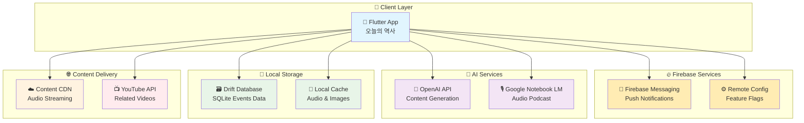
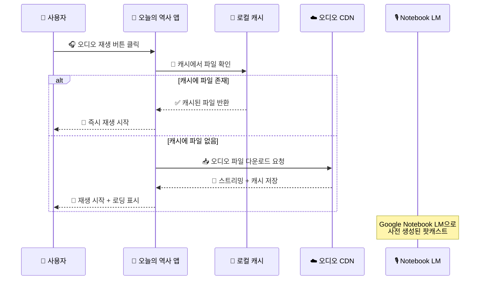
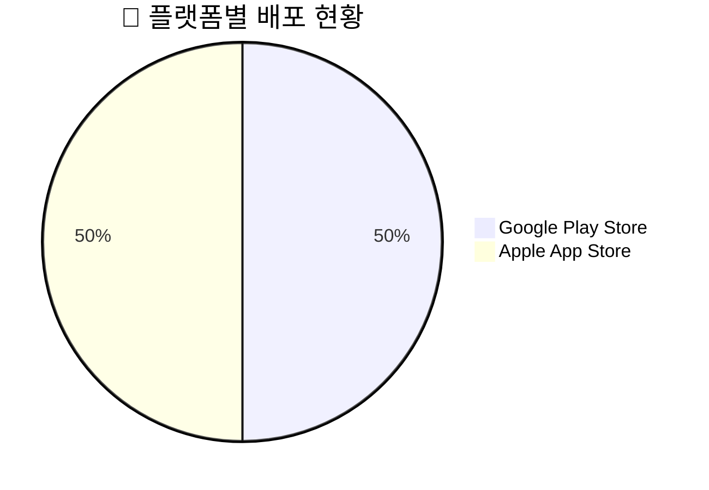
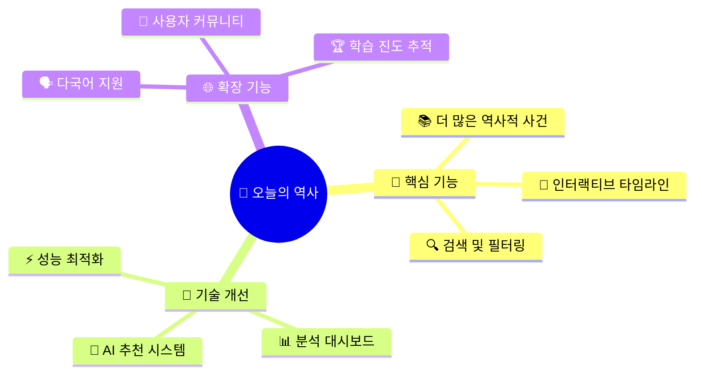
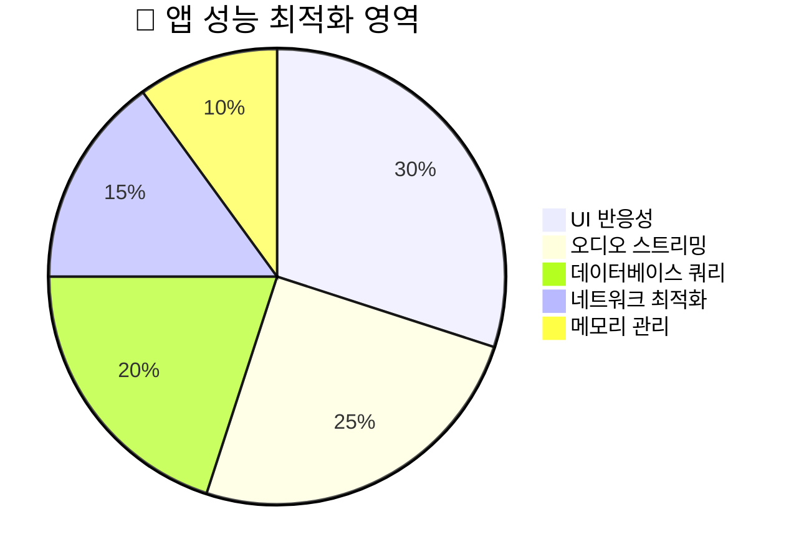

# 🍯 오늘의 역사 - 일일 역사 학습 앱 📚

> 매일 새로운 역사적 사건을 발견하고 학습하는 즐거움! AI와 함께하는 역사 여행을 시작해보세요.

[](https://flutter.dev)
[](https://dart.dev)
[](https://firebase.google.com)
[](https://cloud.google.com/)
[](https://openai.com/)

<div align="center">

[](https://play.google.com/store/apps/details?id=com.izowooi.honey_history)
[](https://apps.apple.com/kr/app/역사-이야기/id6751049464)

</div>

## 🚀 프로젝트 소개

오늘의 역사는 매일 다른 역사적 사건을 학습할 수 있는 Flutter 기반 교육용 모바일 앱입니다. 사용자는 날짜별로 흥미진진한 역사적 사건들을 발견하고, 오디오 해설과 관련 영상을 통해 깊이 있는 학습 경험을 할 수 있습니다.

### ✨ 주요 기능

- 📅 **일일 역사 사건**: 매일 다른 날짜의 역사적 사건 제공
- 🎧 **오디오 해설**: Google Notebook LM 기술로 생성된 팟캐스트 스타일 오디오
- 🎬 **관련 영상**: YouTube 연동으로 관련 다큐멘터리 및 영상 제공
- 🎨 **시각적 삽화**: 각 사건별 맞춤형 일러스트레이션
- 🤖 **AI 콘텐츠**: OpenAI API로 생성된 교육적이고 흥미로운 텍스트 콘텐츠
- 🔔 **푸시 알림**: Firebase를 통한 일일 학습 리마인드
- 📱 **반응형 디자인**: 모든 기기에서 최적화된 사용자 경험

## ⚙️ 빠른 시작 (개발용)

### 📋 필수 요구사항
- 🐦 Flutter SDK 3.2.3+
- 🎯 Dart SDK 3.2.3+
- 🔥 Firebase 프로젝트 설정
- 🔑 OpenAI API Key (콘텐츠 생성용)

### 🛠️ 로컬 개발 시작하기

1. **저장소 클론**
   ```bash
   git clone https://github.com/izowooi/honey-history.git
   cd flutter_proj
   ```

2. **의존성 설치**
   ```bash
   flutter pub get
   ```

3. **앱 실행**
   ```bash
   flutter run
   ```

4. **특정 기기에서 실행**
   ```bash
   flutter run -d <device_id>
   ```

### 📱 앱 동작 핵심
앱은 Drift(SQLite) DB를 사용하여 로컬에 역사적 사건 데이터를 저장합니다. 첫 실행 시 사전 구축된 데이터베이스를 복사하고, UI는 `Riverpod` + `Drift` 조합으로 날짜별 사건을 효율적으로 표시합니다.

## 🏛️ 시스템 아키텍처



---

## 💾 데이터베이스 초기화 (가장 중요)
앱은 기본적으로 `lib/historical_events.json`을 읽어 SQLite에 시드합니다. 콘텐츠를 바꾸거나 데이터를 갱신하고 싶다면 JSON을 수정하세요.

### 1) 입력 JSON 준비
- 기본 예시는 `lib/historical_events.json` 입니다. 또는 `assets/data/historical_events.json`로 위치를 옮기고 코드에서 경로를 조정할 수 있습니다.

### 2) DB 자동 시드
- `lib/db/app_database.dart`에서 앱 최초 생성 시 JSON을 읽어 테이블(`HistoryEvents`)에 삽입합니다.

### 3) 앱 실행 시 자동 생성
- 앱이 실행되면 Drift가 자동으로 테이블을 만들고, JSON에서 데이터를 로드합니다.

▶︎ 중요: 실행 환경/경로 주의
- JSON은 `rootBundle.loadString('lib/historical_events.json')`로 로드합니다(앱 번들 기준 경로). 필요 시 `assets/data/historical_events.json`로 옮기고 `pubspec.yaml`의 assets에 등록하세요.

대안(앱 내부에서만 읽어야 하는 경우 - 비권장)
- JSON을 에셋으로 선언한 뒤, 앱 코드에서 `rootBundle`로 읽어 파싱하세요. 예시:
```dart
import 'dart:convert';
import 'package:flutter/services.dart' show rootBundle;

Future<List<HistoryEvent>> loadHistoryEventsFromJson() async {
  final jsonString = await rootBundle.loadString('assets/data/historical_events.json');
  final Map<String, dynamic> jsonData = json.decode(jsonString);
  // 파싱 로직 유지
}
```
- 주의: 이 방식은 Flutter 앱 런타임에서만 동작하며, CLI(`dart run`)에서는 `rootBundle`이 없어 실패합니다.

### 4) JSON 자산 반영
- `pubspec.yaml`의 assets 섹션에 `lib/historical_events.json`이 포함되어 있습니다(앱 번들 포함). 수정 후 `flutter pub get`을 실행하세요.

### 5) 앱이 DB를 어떻게 로드하는지
- `AppDatabase`가 생성될 때 테이블을 만들고 JSON을 시드합니다. UI는 `id == 'MM-dd'` 형태로 조회합니다.

---

## 🔍 기술 스택 상세

### 🎨 Flutter & Dart 생태계
- **Flutter SDK**: 크로스 플랫폼 모바일 앱 개발
- **Riverpod**: 반응형 상태 관리 솔루션
- **Drift**: SQLite ORM으로 로컬 데이터베이스 관리
- **Material Design 3**: 현대적인 UI/UX 디자인 시스템

### 🤖 AI & 콘텐츠 생성
- **OpenAI GPT**: 역사적 사건에 대한 교육적 콘텐츠 생성
- **Google Notebook LM**: 팟캐스트 스타일의 오디오 해설 생성
- **Dynamic Content**: 날짜별 맞춤형 역사 콘텐츠 제공

### 🔥 Firebase 생태계
- **Firebase Messaging**: 푸시 알림 및 토픽 구독
- **Firebase Remote Config**: 실시간 기능 플래그 및 설정 관리
- **Firebase Analytics**: 사용자 행동 분석 (선택사항)

### 📱 멀티미디어 & 스트리밍
- **just_audio**: 고품질 오디오 재생 및 스트리밍
- **youtube_player_flutter**: YouTube 동영상 통합 재생
- **Local Caching**: 오디오 파일 로컬 캐싱으로 오프라인 지원

---

## 🧱 개발 가이드

### 데이터베이스 스키마 변경 시 (코드 생성)
테이블을 바꾸면(`lib/db/app_database.dart`) 코드 생성이 필요합니다.

1) 모델 수정 예시
```1:18:/Users/izowooi/git/honey-history/flutter_proj/lib/history_event.dart
@RealmModel()
class _HistoryEvent {
  late String id;
  late String title;
  late String year;
  late String simple;
  late String detail;
  late String youtube_url;
}
```
2) 코드 생성 실행
```bash
dart run build_runner build --delete-conflicting-outputs
```
3) 모델이 바뀌면 기존 DB와 스키마가 어긋날 수 있으니, 위의 "Realm DB 만들기/갱신하기" 절차로 새 DB를 생성해 갱신하세요.

### 🎧 오디오 스트리밍 시스템 

앱의 핵심 기능 중 하나인 오디오 재생은 다음과 같은 흐름으로 작동합니다:



---

## 🧪 개발 팁 & 모범 사례
- 날짜 포맷은 `MM-dd`로 조회합니다. 예: `07-01`의 삽화는 `assets/illustration/0701.webp`를 사용.

### 🔊 오디오 재생 정책 변경
- 더 이상 오디오 파일을 앱에 내장하지 않습니다.
- 재생 버튼 클릭 시 날짜 기반 URL에서 스트리밍+캐싱하여 재생합니다. 예: 8월 15일 → `https://honeyhistory.zowoo.uk/audio/0815.mp3`
- 최초 재생 시 임시 디렉터리에 캐싱 후, 이후 재생은 캐시 파일을 사용합니다.
- 파일이 없거나 네트워크 오류 시 스낵바로 간단히 안내합니다.

코드 포인트
```12:86:/Users/izowooi/git/honey-history/flutter_proj/lib/providers/audio_provider.dart
// URL 조합 → 캐시 확인/다운로드 → just_audio setFilePath → duration 표기
```
```28:75:/Users/izowooi/git/honey-history/flutter_proj/lib/widget/daily_calendar_widget.dart
// '오디오 없음' UI 제거, 실패 시 SnackBar 표시
```

---

## 🎨 앱 아이콘 변경
앱 아이콘을 변경하려면 `flutter_launcher_icons` 패키지를 사용합니다.

### 1) 의존성 추가
```yaml
dev_dependencies:
  flutter_launcher_icons: ^0.14.4
```

### 2) 설정 추가
`pubspec.yaml`에 아이콘 설정을 추가합니다:
```yaml
flutter_launcher_icons:
  android: "launcher_icon"  # 안드로이드: android/app/src/main/res/
  ios: true                 # iOS: ios/Runner/Assets.xcassets/AppIcon.appiconset/
  image_path: "assets/icon/app_icon.png"  # 1024x1024 PNG
  min_sdk_android: 21      # Android minSdkVersion
  remove_alpha_ios: true   # iOS에서 알파 채널 제거
  web:
    generate: false
  windows:
    generate: false
  macos:
    generate: false
```

### 3) 아이콘 생성
```bash
# 의존성 설치
flutter pub get

# 아이콘 생성
dart run flutter_launcher_icons
```

### 4) 주의사항
- 소스 이미지(`image_path`)는 1024x1024 PNG 권장
- iOS는 알파 채널 없는 이미지 필요 ( 현재 : assets/icon/icon.png )
- Android adaptive icon 사용 시 추가 설정 필요:
```yaml
flutter_launcher_icons:
  android: true
  adaptive_icon_background: "#FFFFFF"  # 배경색
  adaptive_icon_foreground: "assets/icon/android_foreground.png"  # 전경 이미지
```

---

## 🚑 Troubleshooting
- "파일을 찾을 수 없습니다" (gen 스크립트): `lib/gen_realm.dart`의 JSON 경로를 실제 파일로 바꿨는지 확인.
- "스키마 불일치/필드 누락": 모델 수정 후 `flutter pub run realm generate` 재실행 + 새 Realm DB 생성 후 `assets/history_events.realm` 교체.
- 앱에서 DB가 비어 보임: 에셋이 교체되었는지, 최초 실행 시 복사가 일어났는지 로그로 확인. 필요 시 앱 삭제 후 재설치(문서 폴더 초기화).

---

## 🚀 빌드 & 배포 가이드

### 🏗️ 프로덕션 빌드
- Android 서명: 아래 키스토어 명령 참고 후 `android/app/build.gradle`에 서명 설정.
- Android AAB 빌드:
```bash
flutter build appbundle --release
```
  - 결과 파일: `build/app/outputs/bundle/release/app-release.aab`
- iOS: Xcode에서 번들 ID/서명 설정 후 Archive.

### 📊 앱 스토어 현황

<div align="center">



**🔗 다운로드 링크:**
- 📟 **Android**: [Google Play Store](https://play.google.com/store/apps/details?id=com.izowooi.honey_history)
- 🍎 **iOS**: [Apple App Store](https://apps.apple.com/kr/app/역사-이야기/id6751049464)

</div>

### 🧰 개발자 명령어 치트시트
- `flutter build appbundle --release`
  - Android용 AAB 생성 명령. 구글 플레이 업로드 시 사용.

- iOS CocoaPods 재설치(Pods 오류·iOS 타깃 변경 후 권장)
```bash
cd ios
rm -rf Pods Podfile.lock
pod repo update
pod install
cd ..
flutter clean
flutter pub get
```
  - Pod 캐시 불일치, iOS 배포 타깃/의존성 변경 이후 빌드 이슈 해결에 사용.

- 특정 디바이스로 실행(디버그/프로파일)
```bash
flutter run -d <device_id>
```
  - 예: `flutter run -d 00008110-000E31D41412801E`
  - iOS 14+에서 USB 분리 상태로 홈스크린에서 직접 실행하려면 Release/Profile 빌드가 필요합니다.

- iOS Release 빌드(아카이브/테스트플라이트용)
```bash
flutter build ios --release
```
  - Xcode Organizer에서 배포 또는 TestFlight 업로드에 사용.

---

## 🔐 키스토어(배포 준비)
프로덕션 빌드를 위한 Android 서명 키 생성 명령입니다.
```bash
keytool -genkey -v -keystore honey-history.jks -keyalg RSA -keysize 2048 -validity 10000 -alias honey-history
```
- 생성된 `honey-history.jks`와 비밀번호는 안전하게 보관하세요. `android/app/build.gradle`의 `signingConfigs`와 `buildTypes.release`에 연결합니다.

---

## ✍️ 프롬프트 가이드(콘텐츠 제작 보조)
앱에서 사용할 텍스트/오디오/이미지 콘텐츠를 만들 때 도움이 되는 프롬프트 예시입니다.

### 사건 생성
오늘의 흥미롭고 재미있는 역사적 사건을 알려주는 앱을 만들고 있어. 오늘 날짜를 가정하고, 사건에 해당하는 내용을 설명해줘. 오늘 날짜 : 7월10일 (년도는 미정 2025년 일 수도, 2026년 일 수도 있음.) 사건 혹은 인물명 : 영국 전투 시작. 위의 정보로 2차대전 영국 전투 시작에 대해서 설명해줘. 두 가지 버전을 설명해줘. 하나는 초등학생용 300 글자 내외, 나머지 하나는 고등학생 1500 글자 내외로 설명해줘. 두 버전 모두 문단은 나눠도 되지만 문단과 문단 사이에 소제목을 넣지 말아줘. 그리고 • 와 같은 걸로 나누지도 말아줘. 그냥 선생님이 학생에게 알려주듯 주욱 글을 적어줘. 반드시 이모지를 충분히 사용하고, 흥미를 끌 수 있게 작성해줘.

### 오디오 생성
오늘이 ( 7월 16일 ) 트리니티 실험 날짜와 같다고 가정하고 진행해줘. ( 이 때 년도는 가정하지 않을게. 올해가 2025 년일수도 있고, 2026 년일 수도 있어. ) 내가 전달한 텍스트와, url 은 언급하지 말고, 자료를 전달 받은 것 자체를 언급하지 말아줘. 자연스럽게 트리니티 실험에 대해서 알려주는 컨텐츠로 부탁해.

### 이미지 생성
이 이미지는 1차 아편전쟁을 그린 삽화야. 이 이미지를 comfy ui 를 통해서 애니메이션 풍으로 그렸으면 좋겠어. 프롬프트를 추천해줘. 모델은 wildcard xl animation 을 사용할거야.

---

## 🔍 프로젝트 구조

```
📦 flutter_proj/
├── 🎨 lib/
│   ├── 🗃️ db/                     # Drift 데이터베이스 레이어
│   │   ├── app_database.dart     # 메인 데이터베이스 클래스
│   │   ├── app_database.g.dart   # 생성된 코드
│   │   └── db_initializer.dart   # DB 초기화 로직
│   ├── 🎭 providers/              # Riverpod 상태 관리
│   │   ├── historical_event_provider.dart
│   │   ├── audio_provider.dart
│   │   ├── settings_provider.dart
│   │   └── remote_config_provider.dart
│   ├── 🎪 widgets/                # 재사용 가능한 UI 컴포넌트
│   │   ├── history/
│   │   ├── movie/
│   │   └── settings/
│   ├── 🛠️ services/               # 플랫폼 서비스
│   │   └── push_notification_service.dart
│   ├── 🎯 main.dart              # 앱 진입점
│   └── 📊 model/                 # 데이터 모델
├── 🎨 assets/
│   ├── 📊 data/                  # 정적 데이터
│   │   ├── history_events.sqlite # 사전 구축 DB
│   │   └── movies.json
│   ├── 🖼️ illustration/          # 역사적 사건 삽화
│   └── 🎯 icon/                  # 앱 아이콘
├── 🔥 firebase/                  # Firebase 설정
├── 🤖 android/                   # Android 플랫폼 설정
├── 🍎 ios/                      # iOS 플랫폼 설정
└── 📋 pubspec.yaml              # 프로젝트 의존성
```

---

## 🌟 미래 로드맵



## 🗒️ TODO (기능 추가 예정)

- **오디오 파일 와이파이에서 일괄 다운로드**
  - 와이파이 연결 시 365개의 일자별 오디오를 일괄 선다운로드하는 기능.
  - 이미 받은 날짜는 건너뛰고 나머지만 이어서 받기: 예) 10개 완료 시 10/365에서 시작, 50개 완료 시 50/365에서 시작.
  - 진행률(Progress) 표시: 퍼센트/분수 형태로 시각화(예: 123/365, 33%).
  
- **DB 원격 다운로드(버전 관리 + CDN 갱신)**
  - 바이너리에 포함된 DB 대신, CDN에 올린 최신 버전의 DB를 앱 시작 시 버전 비교 후 필요 시 갱신.
  - 로컬에 현재 DB 버전 기록 → 원격 버전 메타(JSON 등) 조회 → 로컬 < 원격일 때만 다운로드/교체.
  - 무결성 검증(해시 체크) 및 다운로드 실패 시 롤백 전략 포함.

- **햅틱 진동(Haptics) 추가**
  - 날짜 이동, 설정 변경, 버튼 탭 등 주요 사용자 액션에 미세한 햅틱을 제공하여 UX 향상.
  - 플랫폼별(안드로이드/iOS) 적절한 강도/피드백 타입 매핑.
  - 접근성(설정에서 온/오프 토글) 고려.

---

## 📊 성능 지표

### 🎯 앱 성능 메트릭스



**✅ 달성한 성능 목표:**
- 🚀 **앱 시작 시간**: 2초 이내 초기 화면 로드
- ⚡ **데이터베이스 쿼리**: 50ms 이내 날짜별 이벤트 조회
- 📱 **UI 반응성**: 60fps 유지로 부드러운 사용자 경험
- 🎧 **오디오 스트리밍**: 5초 이내 재생 시작 (캐시 없는 상태)
- 💾 **메모리 사용량**: 평균 100MB 이하 유지

---

## 📄 라이센스

이 프로젝트는 MIT 라이센스 하에 배포됩니다. 자세한 내용은 `LICENSE` 파일을 확인하세요.

---

<div align="center">

**🍯 매일 새로운 역사의 발견, 오늘의 역사와 함께하세요! 📚✨**

[](https://play.google.com/store/apps/details?id=com.izowooi.honey_history)
[](https://apps.apple.com/kr/app/역사-이야기/id6751049464)

Made with 💖 by izowooi

</div>