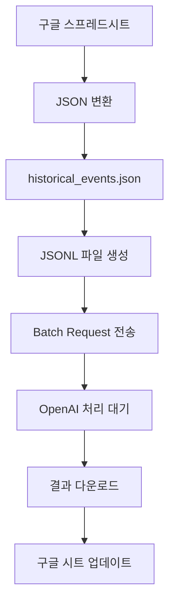

# 🏛️ Historical Events Batch Processing

OpenAI Batch API를 활용한 역사적 사건 콘텐츠 자동 생성 시스템입니다.  
구글 스프레드시트의 역사적 사건 데이터를 OpenAI API로 처리하여 상세한 콘텐츠를 생성하고, 다시 구글 시트에 업데이트하는 전체 워크플로우를 제공합니다.

## 📋 목차

- [시스템 개요](#-시스템-개요)
- [사전 준비](#-사전-준비)
- [단계별 사용법](#-단계별-사용법)
- [스크립트 설명](#-스크립트-설명)
- [젠킨스 자동화](#-젠킨스-자동화)
- [모델 정보](#-모델-정보)
- [문제 해결](#-문제-해결)

## 🎯 시스템 개요

이 시스템은 다음과 같은 8단계로 구성됩니다:



## 🛠️ 사전 준비

### 1. 환경 설정
```bash
# Python 가상환경 생성
python3 -m venv venv
source venv/bin/activate

# 의존성 설치
pip install -r requirements.txt
```

### 2. API 키 설정
`.env` 파일을 생성하고 다음 내용을 추가하세요:
```bash
OPENAI_API_KEY=your_openai_api_key_here
```

### 3. Google Sheets API 설정
- Google Cloud Console에서 서비스 계정 생성
- `credentials.json` 파일을 프로젝트 루트에 저장
- 구글 스프레드시트를 서비스 계정과 공유

## 📖 단계별 사용법

### 1단계: 구글 스프레드시트에서 JSON 변환

구글 스프레드시트에서 데이터를 JSON 형태로 내보냅니다.

**예상 데이터 형식:**
```json
{
  "04-01": {
    "id": "04-01",
    "title": "오키나와 전투 개시",
    "year": "",
    "content_simple": "",
    "content_detailed": "",
    "imageUrl": "ComfyUI_0039.png",
    "relatedMovieId": "movie_0002"
  }
}
```

### 2단계: 데이터 파일 준비

1단계에서 받은 JSON 데이터를 `historical_events.json` 파일에 복사합니다.

```bash
# 파일 위치 확인
ls -la historical_events.json
```

### 3단계: JSONL 파일 생성

배치 요청용 JSONL 파일을 생성합니다.

#### 일반 모델용 (GPT-4 등)
```bash
python3 batch_file_generator.py --model gpt-4.1-mini-2025-04-14
```

#### 추론 모델용 (o3, o4 등)
```bash
python3 batch_file_generator.py --model o4-mini-2025-04-16
```

#### 사용 가능한 모델들
- `gpt-4.1-nano-2025-04-14` - 가장 빠른 추론 (저비용)
- `gpt-4.1-mini-2025-04-14` - 비용 효율적 균형
- `gpt-4.1-2025-04-14` - 플래그십 균형
- `o4-mini-2025-04-16` - 비용 효율적 추론
- `o3-mini-2025-01-31` - 추론 모델
- `o3-2025-04-16` - 가장 강력한 추론

**생성되는 파일:** `batchinput.jsonl`

### 4단계: 배치 요청 전송

생성된 JSONL 파일로 OpenAI 배치 요청을 전송합니다.

```bash
python3 batch_runner.py
```

**실행 결과:**
```
🚀 배치 작업 실행기
==================================================
📁 배치 파일: batchinput.jsonl
🤖 사용 모델: o4-mini-2025-04-16
📝 작업 설명: History content generation

✅ 배치 작업이 성공적으로 시작되었습니다!
📋 배치 ID: batch_abc123def456
```

**중요:** 배치 ID를 반드시 기록해두세요!

### 5단계: 배치 상태 확인

OpenAI 대시보드 또는 스크립트로 배치 상태를 확인합니다.

#### 방법 1: OpenAI 대시보드
[OpenAI Batches 페이지](https://platform.openai.com/batches)에서 상태 확인

#### 방법 2: 스크립트 사용
```bash
python3 batch_status_checker.py --batch-id batch_abc123def456
```

**상태별 의미:**
- `validating` - 요청 검증 중
- `in_progress` - 처리 중
- `finalizing` - 마무리 중
- `completed` - 완료 ✅
- `failed` - 실패 ❌

### 6단계: 결과 다운로드

배치가 완료되면 자동으로 결과를 다운로드합니다.

```bash
# 배치 완료 후 실행
python3 batch_status_checker.py --batch-id batch_abc123def456
```

**결과 파일:** `out/processed_results_batch_abc123def456.json`

**결과 구조:**
```json
[
  {
    "custom_id": "04-01",
    "content": {
      "simple": "간단한 설명...",
      "detail": "상세한 설명...",
      "year": "1945",
      "related_movies": "관련 영화 목록"
    }
  }
]
```

### 7단계: 구글 시트 업데이트

처리된 결과를 구글 스프레드시트에 업데이트합니다.

```bash
python3 sheets_updater.py --json-file out/processed_results_batch_abc123def456.json
```

**업데이트 대상:**
- **C열**: year (연도)
- **D열**: simple (간단한 설명)
- **E열**: detail (상세한 설명)
- **F열**: related_movies (관련 영화)

**특징:**
- 기존 데이터가 있는 행은 자동 스킵
- 배치 업데이트로 API 할당량 최적화
- 실시간 진행 상황 표시

### 8단계: 결과 확인

구글 스프레드시트에서 업데이트된 데이터를 확인합니다.

## 🔧 스크립트 설명

### 핵심 스크립트

| 스크립트 | 역할 | 사용 시점 |
|---------|------|----------|
| `batch_file_generator.py` | JSONL 파일 생성 | 3단계 |
| `batch_runner.py` | 배치 요청 전송 | 4단계 |
| `batch_status_checker.py` | 상태 확인 및 결과 다운로드 | 5-6단계 |
| `sheets_updater.py` | 구글 시트 업데이트 | 7단계 |

### 지원 스크립트

| 스크립트 | 역할 |
|---------|------|
| `openai_batch_service.py` | OpenAI API 서비스 |
| `sheets_service.py` | Google Sheets API 서비스 |
| `sheets_test.py` | Google Sheets 연결 테스트 |
| `openai_o3_batch_example.py` | o3 모델 사용 예시 |

## 🤖 모델 정보

### 비용 효율성 (입력/출력 토큰당 $)

| 모델 | 입력 | 출력 | 특징 |
|------|------|------|------|
| `gpt-4.1-nano-2025-04-14` | 0.4 | 1.6 | 가장 빠른 추론 |
| `gpt-4.1-mini-2025-04-14` | 0.4 | 1.6 | 비용 효율적 균형 |
| `o4-mini-2025-04-16` | 1.1 | 4.4 | 비용 효율적 추론 |
| `gpt-4.1-2025-04-14` | 2.0 | 8.0 | 플래그십 균형 |
| `o3-mini-2025-01-31` | 1.1 | 4.4 | 추론 모델 |
| `o3-2025-04-16` | 2.0 | 8.0 | 가장 강력한 추론 |

### 처리 시간
- **80개 요청 기준**: 약 20분 (gpt-4.1-2025-04-14)
- **추론 모델**: 더 긴 처리 시간 (고품질 결과)

## 🚀 젠킨스 자동화

### 배치 요청 파이프라인
```bash
#!/bin/bash
PYTHON_PROJ=$WORKSPACE/python_gen_script
PYTHON_PATH="/opt/homebrew/Cellar/python@3.11/3.11.13/bin/python3.11"

cd $PYTHON_PROJ
source venv/bin/activate

# 여러 모델로 배치 생성
python3 batch_file_generator.py --model o4-mini-2025-04-16
python3 batch_file_generator.py --model gpt-4.1-mini-2025-04-14
python3 batch_file_generator.py --model o3-2025-04-26

# 배치 실행
python3 batch_runner.py

deactivate
```

### 결과 다운로드 파이프라인
```bash
#!/bin/bash
PYTHON_PROJ=$WORKSPACE/python_gen_script

cd $PYTHON_PROJ
source venv/bin/activate

# 배치 결과 확인 및 다운로드
python3 batch_status_checker.py --batch-id batch_abc123def456
python3 batch_status_checker.py --batch-id batch_def456ghi789

deactivate
```

## ⚠️ 문제 해결

### 자주 발생하는 오류

#### 1. API 할당량 초과
```
APIError: [429]: Quota exceeded for quota metric 'Write requests'
```
**해결방법**: `sheets_updater.py`의 배치 업데이트 로직이 이를 방지합니다.

#### 2. 추론 모델 파라미터 오류
```
Unsupported parameter: 'temperature' is not supported with this model
```
**해결방법**: o3/o4 모델은 `temperature` 파라미터를 지원하지 않습니다. 코드에서 자동 처리됩니다.

#### 3. 인증 오류
```
❌ OPENAI_API_KEY가 설정되지 않았습니다.
```
**해결방법**: `.env` 파일에 올바른 API 키를 설정하세요.

### 도움말 명령어

각 스크립트의 상세한 옵션을 확인하려면:

```bash
python3 batch_file_generator.py --help
python3 batch_runner.py --help
python3 batch_status_checker.py --help
python3 sheets_updater.py --help
```

## 📊 성능 최적화 팁

1. **배치 크기**: 한 번에 100개 이하 요청 권장
2. **모델 선택**: 작업 복잡도에 따라 적절한 모델 선택
3. **API 할당량**: 추론 모델 사용 시 토큰 소모량 주의
4. **결과 저장**: `out/` 폴더에 자동 저장되므로 중복 다운로드 방지

## 💡 OpenAI 알아둘 점

- **크레딧 만료**: 1년이 지나면 크레딧이 만료됩니다
- **추론 모델**: 4000 토큰도 빠르게 소진될 수 있습니다 (추론 과정에서 많은 토큰 사용)
- **배치 할인**: 배치 API 사용 시 50% 할인 적용

---

문의사항이나 개선 제안이 있으시면 이슈를 등록해 주세요! 🚀